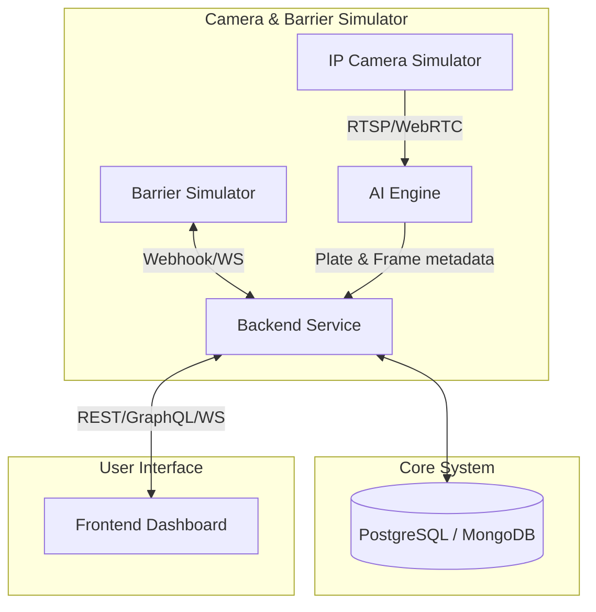

# Smart Parking & ALPR System

## 1. Tổng quan Dự án (Project Overview)
Hệ thống Đỗ xe Thông minh và Nhận diện Biển số Tự động (ALPR - Automatic License Plate Recognition) ứng dụng AI/CV. Đây là phiên bản phần mềm (Software-only Demo), thay thế phần cứng vật lý bằng hệ thống giả lập.

*(Phát triển dựa trên cốt lõi của bài toán Nhận diện các ký tự chữ cái và chữ số trên biển số xe bằng Machine Learning / Computer Vision).*

## 2. Dataset Nhận diện Biển số (Training Data)
Dataset dùng để huấn luyện model không được đưa trực tiếp lên GitHub do dung lượng lớn. 

Tải dataset tại đây: [Google Drive Dataset](https://drive.google.com/drive/folders/1y5x14eM_T1ECb9GvqghlI_DSCeM9t4s1?usp=sharing)

Sau khi tải về, hãy giải nén và đặt thư mục `dataset` vào thư mục gốc của dự án (`Introduction-to-AI/dataset/`) để mã nguồn AI xử lý dữ liệu chuẩn xác.

## 3. Sơ đồ Kiến trúc Hệ thống (System Architecture)



## 4. Tech Stack
- **AI Engine (Computer Vision):** Python, YOLO, OpenCV, Tesseract/EasyOCR.
- **Backend Service:** Node.js/NestJS hoặc Python/FastAPI, PostgreSQL/Redis.
- **Frontend Dashboard:** React/Next.js hoặc Vue/Nuxt, Tailwind.
- **Simulation Tools:** Python/Node.js cho Mock RTSP Server & Mock Hardware Events.
- **DevOps & Mạng:** Docker, Nginx.

## 5. Hướng dẫn Cài đặt Cục bộ (Local Setup Instructions)
1. **Clone dự án & Thiết lập môi trường:**
   ```bash
   git clone <repo-url>
   cd -Introduction-to-AI
   ```
2. **Khởi chạy Backend:**
   ```bash
   cd backend-service
   cp .env.example .env
   npm install && npm run dev
   ```
3. **Khởi chạy Giao diện Frontend:**
   ```bash
   cd frontend-dashboard
   npm install && npm run dev
   ```
4. **Khởi chạy Hệ thống AI & Giả lập:**
   ```bash
   cd simulation-tools
   # start_rtsp_mock
   ```
   ```bash
   cd ai-engine
   # start_ai_engine
   ```
